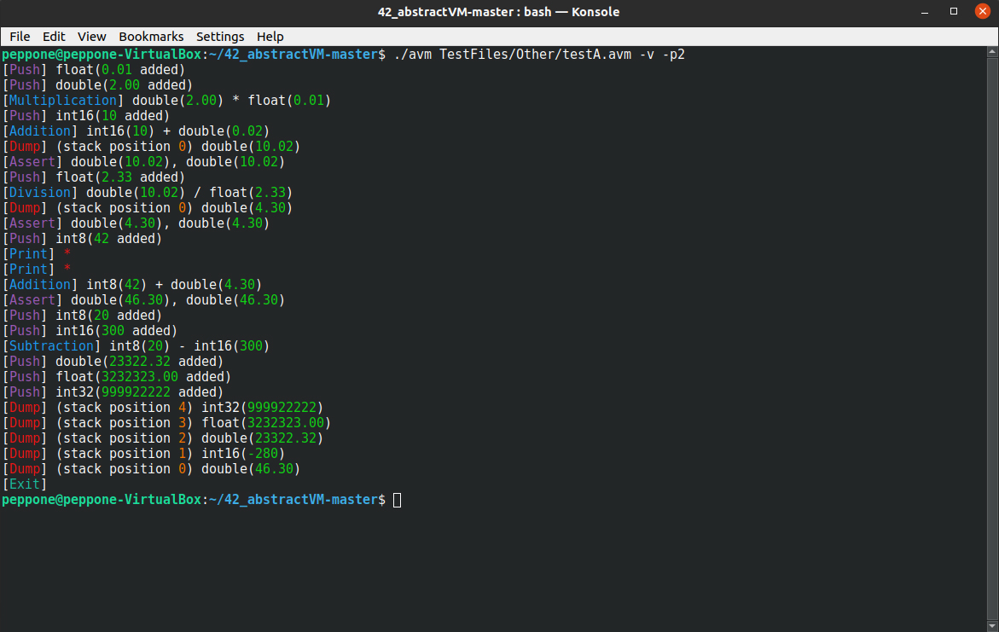

# AbstractVM

The purpose of this project is to create a simple virtual machine that can interpret programs written in a basic assembly language.

AbstractVM is a machine that uses a stack to compute simple arithmetic expressions.
These arithmetic expressions are provided to the machine as basic assembly programs.
AbstractVM must be aable to run programs from a file passed as a parameter and from the standard input.

The language of AbstractVM is composed of a series of instructions:
- ***push*** (Stack a value at the top of the stack)
- ***pop*** (Unstack a value at the top of the stack)
- ***dump*** (Displays each value of the stack)
- ***assert*** (Asserts that the value at the top of the stack is equal to the one passed as parameter)
- ***add*** (Unstacks the first two values on the stack, adds them together and stacks the result)
- ***sub***
- ***mul***
- ***div***
- ***mod***
- ***print*** (Display the value if it is a character)
- ***exit***

AbstractVM uses 5 operand classes that must be declared and defined:
- *Int8*
- *Int16*
- *Int32*
- *Float*
- *Double*

(I have chosen to use a template for that [Operand.hpp](includes/Operand.hpp))

Each one of these operand must implement the following interface [IOperand.hpp](includes/IOperand.hpp)

New operands must be created via a "factory method" [OperandFactory.hpp](includes/OperandFactory.hpp)

Realized bonus:
- Diagnosing of all errors in a file without stopping at the first encountered
- Having a well structured lexer/parser couple
- Possibility to run the program in verbose and interactive mode
- Possibility to change the precision of floating point values
- Possibility to see the Lexer tokens
- Colors
- Instructions: min, max, pow, sin, cos, lshift, rshift, push, assert

  
[example00.avm](TestFiles/Examples/example00.avm)
  
[hard03.avm](TestFiles/Hard/hard03.avm)
  
[testA.avm](TestFiles/Other/testA.avm)
  
[testF.avm](TestFiles/Other/testF.avm)

_If you are interested in the complete code, please do not hesitate to contact me._
